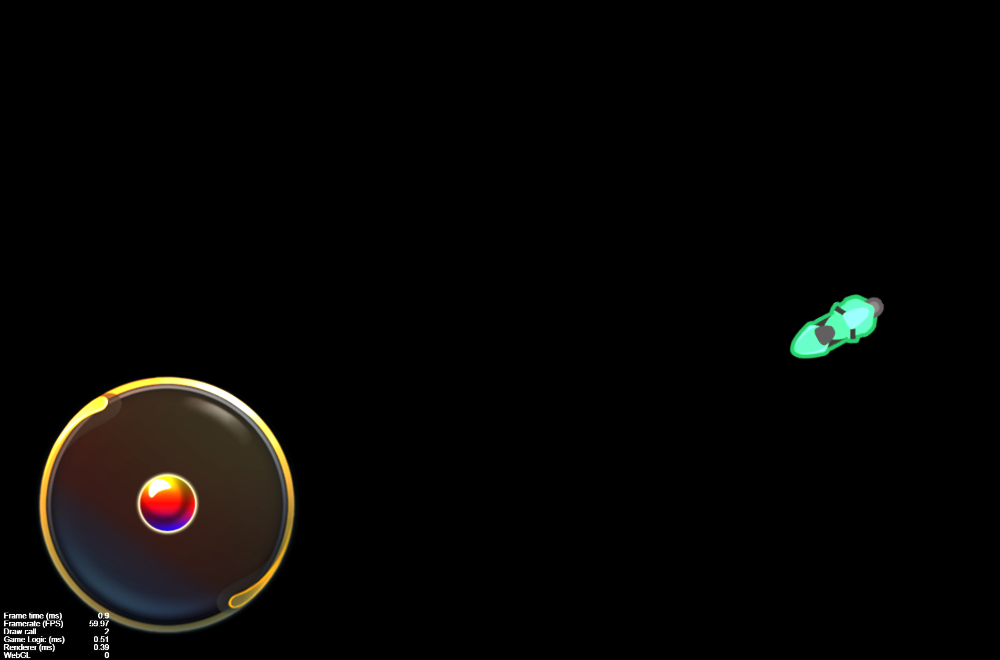

# 知识要点
## 坐标
let pos=this.node.convertToNodeSpaceAR(e.getLocation());
## 计算坐标之间的距离
 let temp=pos.sub(cc.v2(0,0)); 
 let r=Math.abs(temp.mag());

## 归一化
let p=temp.normalize();

## 角度
let d=90-Math.atan2(p.y,p.x)*(180/Math.PI); 
        console.log(d); 
        this.player.setRotation(d); 
        this.playerV3=cc.v3(p); 

## 方向增量
 let newPos=this.player.position.add(this.playerV3;
 this.player.setPosition(newPos);
 ## demo截图
 
